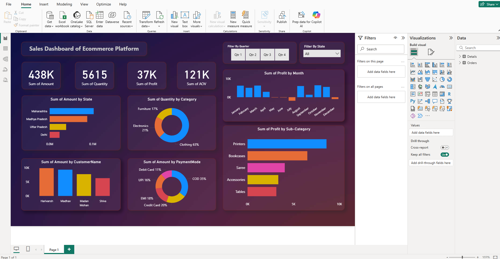

# Ecommerce Sales Dashboard

## Overview

This project features an interactive Power BI dashboard that visualizes sales data from an ecommerce platform. The dashboard provides comprehensive insights into sales performance, customer behavior, product trends, and key business metrics, enabling data-driven decision-making for stakeholders.

## Features

- **Sales Analysis:** Track total sales, revenue trends, and sales growth over time.
- **Customer Insights:** Analyze customer demographics, purchase patterns, and segmentation.
- **Product Performance:** Identify top-selling products, categories, and inventory status.
- **Geographical Distribution:** Visualize sales distribution across different regions.
- **Interactive Filters:** Drill down into specific time periods, products, or customer segments.

## Getting Started

1. **Requirements:**
   - [Power BI Desktop](https://powerbi.microsoft.com/desktop/)

2. **Usage:**
   - Download or clone this repository.
   - Open `SalesDashboard.pbix` in Power BI Desktop.
   - Connect to your data source if required, or use the sample data provided.
   - Explore the dashboard and interact with the visualizations.

## Screenshot

See `dashboard-preview.png` for a preview of the dashboard layout and visualizations.

## License

This project is for educational and demonstration purposes.

---